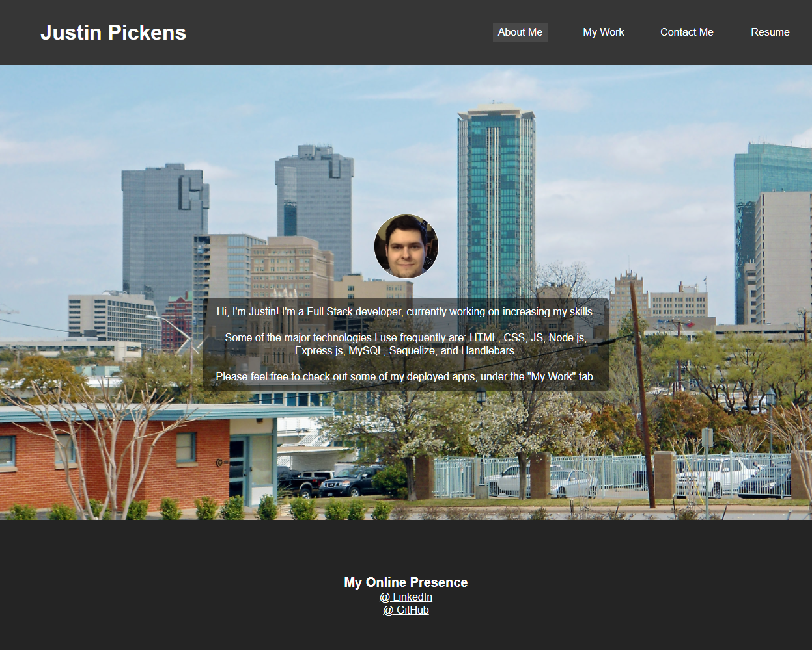

# react-portfolio

## Description
To practice working with React, I refactored my old portfolio to be rendered exclusively with it. Using props, I was quickly able to implement conditional rendering for the site's page tabs. Using useState, I was easily able to change render style based on variables.

## Link
[Click here to see the finished site.](https://jcpickens0215.github.io/react-portfolio/)

## Screenshot

## Questions
If you have any questions about this project, you can find me on GitHub as [jcpickens0215](https://github.com/jcpickens0215).

## License

Licensed under the [MIT License](https://mit-license.org/)
, copyright 2021 by Justin Pickens
____

Badges provided by [Shields.io](https://shields.io/)